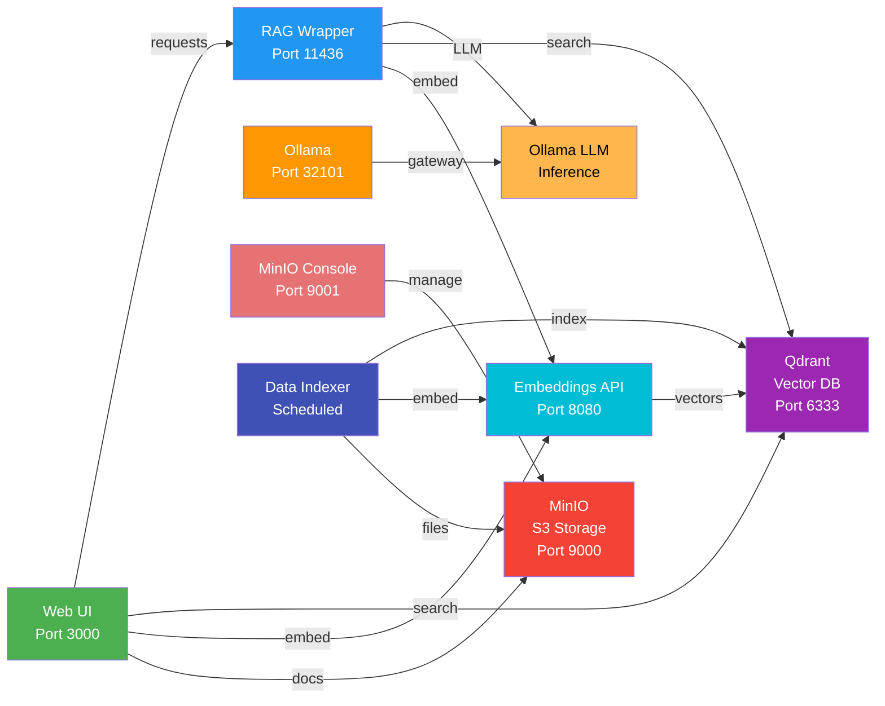

# Architecture Overview

Complete technical architecture of the Enterprise RAG System.

## System Design



## Core Components

### 1. Ollama - LLM Inference Engine

Run large language models locally

#### Key Features
- Open-source language models (Llama2, Mistral, Neural Chat, etc.)
- CPU and GPU support
- Model management and caching
- Automatic model downloading
- RESTful API interface

#### Data Flow
1. Receives text generation requests
2. Processes through language model
3. Returns generated completions or chat responses

### 2. Qdrant - Vector Database

Store and search document embeddings

#### Key Features
- Vector similarity search
- Semantic document retrieval
- Collection management
- Snapshot backups
- RESTful API

#### Data Storage
- Collections: Named groups of vectors
- Points: Individual embeddings with metadata
- Payloads: Document text and metadata

### 3. Text Embeddings Service

Convert text to vector embeddings

#### Key Features
- Converts documents and queries to numerical vectors
- Multilingual support (100+ languages)
- Batch processing for efficiency
- Hugging Face models

#### Default Model
`intfloat/multilingual-e5-base`
- 1024-dimensional vectors
- Optimized for semantic search
- Supports multilingual queries

### 4. MinIO - Document Storage

Store original documents and files

#### Key Features
- S3-compatible object storage
- Web console for management
- Bucket organization
- Metadata support
- Local filesystem backend (cloud-ready)

### 5. RAG Wrapper - Context Injection Layer

Intercept LLM requests and automatically inject relevant context from Qdrant

#### Key Features
- OpenAI-compatible API (`/v1/chat/completions`)
- Automatic vector similarity search
- Transparent context injection (user doesn't select anything)
- Supports multiple Qdrant collections
- Works with any LLM client

#### Data Flow
1. Receives chat completion request
2. Generates embedding for user query
3. Searches Qdrant for similar documents
4. Injects top matches as context
5. Forwards enriched prompt to Ollama
6. Returns response with automatic context

#### When to use
- Production systems needing automatic RAG
- Want context without manual Knowledge Base selection
- Building custom clients

### 6. Open WebUI - User Interface

User-friendly interface for manual document management and selective RAG

#### Key Features
- Interactive document upload
- Manual Knowledge Base creation
- Document search and preview
- Chat interface with selective context
- Conversation history
- Settings management

#### When to use
- Testing and prototyping
- Fine-grained context control
- Keeping different document collections separate

### 7. Data Indexer - Automated Document Processing

Automatically index documents from files and external APIs on a schedule

#### Key Features
- File system monitoring and indexing
- API data harvesting (weather, news, etc.)
- Custom handler plugins for any data source
- Scheduled execution (configurable intervals)
- Automatic Qdrant integration
- Handler-based architecture for extensibility

#### Data Flow
1. Reads configuration from `config/data_sources.json`
2. Executes handlers on schedule
3. Retrieves data from configured sources
4. Generates embeddings via embeddings service
5. Stores in Qdrant collection
6. Ready for automatic RAG via RAG Wrapper

#### When to use
- Production systems with continuous data sync
- Automatic knowledge base from live APIs
- Scheduled document processing
- Custom data source integration

## Data Processing Pipeline

### Document Ingestion Flow

```
1. Upload Document
   ↓
2. Parse & Extract Text
   ├─ PDF extraction
   ├─ DOCX parsing
   ├─ TXT reading
   └─ Other formats
   ↓
3. Text Chunking
   ├─ Split into semantic chunks
   ├─ Maintain context
   └─ Add metadata
   ↓
4. Generate Embeddings
   ├─ Each chunk → vector
   ├─ Embeddings API processes batch
   └─ 1024-dimensional vectors
   ↓
5. Store in Qdrant
   ├─ Insert vectors
   ├─ Store original text in payload
   └─ Index for fast search
   ↓
6. Index Complete
   └─ Document ready for queries
```

### Query Processing Flow

```
1. User Question
   ↓
2. Generate Query Embedding
   └─ Convert question to vector
   ↓
3. Vector Similarity Search
   ├─ Query Qdrant
   ├─ Find most similar documents
   └─ Retrieve top N matches (typically 3-5)
   ↓
4. Retrieve Document Context
   ├─ Get original text from payloads
   └─ Build context prompt
   ↓
5. Generate Response
   ├─ Send context + question to Ollama
   ├─ LLM generates answer
   └─ Include source citations
   ↓
6. Return Results
   └─ Answer with source documents
```

## Service Dependencies

```
Open WebUI (Selective RAG)
├─ depends_on: RAG Wrapper
│  └─ LLM responses
├─ depends_on: Qdrant
│  └─ Vector search & Knowledge Bases
├─ depends_on: Embeddings
│  └─ Query embeddings
├─ depends_on: MinIO
│  └─ Document storage
└─ depends_on: minio-init
   └─ Bucket initialization

RAG Wrapper (Automatic RAG)
├─ depends_on: Ollama
│  └─ LLM inference
├─ depends_on: Qdrant
│  └─ Vector search
└─ depends_on: Embeddings
   └─ Query embeddings

Data Indexer (Scheduled Indexing)
├─ depends_on: Qdrant
│  └─ Vector storage
└─ depends_on: Embeddings
   └─ Document embeddings

MinIO Init (Bucket Setup)
└─ depends_on: MinIO
   └─ Bucket creation
```

## Volume Management

### Data Persistence

| Volume | Service | Purpose | Location |
|--------|---------|---------|----------|
| `ollama_data` | Ollama | LLM models | `/root/.ollama` |
| `qdrant_data` | Qdrant | Vector index | `/qdrant/storage` |
| `minio_data` | MinIO | Documents | `/data` |
| `webui_data` | Web UI | User data | `/app/backend/data` |

### Mounted Directories

| Host Path | Container Path | Service | Purpose |
|-----------|---|---|---|
| `./config` | `/config` | Web UI | Config files |
| `./data/documents` | `/import` | MinIO | Document import path |

## Performance Characteristics

### Latency

| Operation | Typical Time | Notes |
|-----------|---|---|
| Single embedding | 50-100ms | Using multilingual-e5-base |
| Vector search (1M vectors) | 5-10ms | Qdrant optimized |
| LLM token generation | 50-100ms | CPU inference, Llama2 7B |
| Full RAG query | 500-2000ms | Search + generation |

### Throughput

| Component | Capacity | Notes |
|-----------|----------|-------|
| Embeddings batch | 32 texts/batch | Default batch size |
| Vector search | 10K+ queries/sec | Qdrant theoretical max |
| LLM generation | 10-50 tokens/sec | CPU dependent |
| Document upload | 100MB/min | MinIO local storage |

### Storage

| Component | Per Model | Notes |
|-----------|---|---|
| LLM (Llama2 7B) | 4GB | Quantized, in memory |
| Embeddings model | 500MB | Multilingual-e5-base |
| Vector index | ~10KB per chunk | 1024-dimensional vectors |
| Document storage | Variable | Depends on uploaded files |

## Scaling Architecture

### Vertical Scaling (Single Machine)

**Increase resources**:
- More CPU cores → faster embeddings
- More GPU VRAM → faster LLM inference
- More RAM → larger batch sizes
- NVMe SSD → faster I/O

### Horizontal Scaling (Multiple Machines)

**Distributed setup**:
1. **Qdrant Cloud** - Cloud-hosted vector database
2. **MinIO Cluster** - Distributed document storage
3. **Multiple Ollama instances** - Load balanced LLM servers
4. **Kubernetes** - Orchestrate services

## Security Architecture

### Network Isolation

- Services communicate internally
- Only Web UI exposed externally
- Firewall blocks direct service access

### Authentication & Authorization

- MinIO credentials (changeable)
- Optional Web UI authentication
- API key support (production)

### Data Protection

- Local storage only (by default)
- No cloud data transmission
- Encryption at rest (optional)
- Backup encryption (optional)

## RAG Approaches: Manual vs Automatic

The system supports two distinct RAG strategies with different use cases:

### Manual RAG (Open WebUI - Selective)

**Flow:**
```
User Upload
  ↓
Open WebUI Knowledge Base
  ↓
Manual Selection (in chat)
  ↓
Selective Vector Search
  ↓
Context Injection
```

**Characteristics:**
- User explicitly creates Knowledge Bases
- Documents organized by collection
- Manual selection required per chat
- Multiple independent collections
- Fine-grained access control
- Best for: Testing, prototyping, sensitive data isolation

**Configuration:** No setup required - just upload via UI

### Automatic RAG (RAG Wrapper + Data Indexer)

**Flow:**
```
Data Sources (Files, APIs, DBs)
  ↓
Data Indexer Service (scheduled)
  ↓
Automatic Indexing to Qdrant
  ↓
Automatic Vector Search
  ↓
Context Injection (transparent)
```

**Characteristics:**
- Automatic document indexing on schedule
- No manual Knowledge Base selection needed
- All documents in default collection
- Context injection is transparent
- Always-on, production-ready
- Best for: Production, continuous sync, custom sources

**Configuration:** Define `config/data_sources.json` with data sources and handlers

### Comparison

| Aspect | Manual (Open WebUI) | Automatic (RAG Wrapper) |
|--------|-------------------|------------------------|
| **Entry Point** | `localhost:3000` | `localhost:11436` |
| **Setup** | None - just upload | Configure JSON + handlers |
| **User Experience** | UI-driven, interactive | API-driven, programmatic |
| **Context Selection** | Manual per chat | Automatic, transparent |
| **Collection Management** | User creates Knowledge Bases | Single collection per handler |
| **Best For** | Prototyping, control | Production, automation |

## Project Architecture Decisions

### Why RAG Wrapper?

- **Transparent Context**: Users don't need to remember to select Knowledge Bases
- **OpenAI Compatible**: Works with any LLM client expecting OpenAI-compatible API
- **Production-Ready**: Designed for continuous operation
- **Flexible**: Works with any data indexed in Qdrant

### Why Data Indexer?

- **Handler-Based**: Pluggable architecture for any data source
- **Scheduled Execution**: Automatic synchronization with external sources
- **Configuration-Driven**: Defined in JSON, no code changes needed
- **Extensible**: Easy to create custom handlers for new data sources

### Why Open WebUI Still Included?

- **User-Friendly**: Non-technical users can upload documents via UI
- **Knowledge Management**: Organize documents by topic/purpose
- **Exploration**: Perfect for testing and learning
- **Fine-Grained Control**: Choose exactly what context is available per chat

